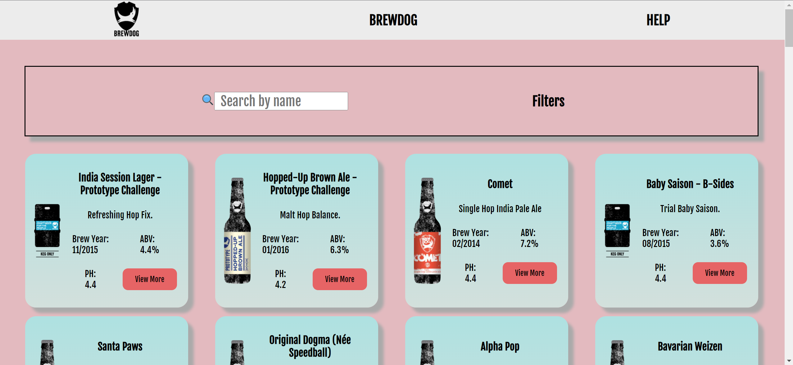

# BREWDOG API

This project is created using React. Here's a link to the live site:

- https://j-jinjia.github.io/brewdog-api-website

The aims of this project were to practice React fundamentals(React components, props, functions as props) as well as using an external API to get the data and display it.

# ABOUT

The Brewdog website was created with:

- Functinality and Layout: JSX and SASS (SCSS, and BEM notation)

It has a responsive design for:

- Mobile devices and tablets up to 768px
- Tablets and small laptops up to 1024px
- Pc monitors and larger devices from 1024px

# Functionality

This website can be navigated as follows:

- Scroll down to have a general look at the different beer options available.
- Use the search bar to look for the desired beer.
- Use the filters for an easier search.
- Click on HELP for more information on the top right of the screen.

# Features

In this website you can:

- Get extra information about the page on clicking HELP in the navigation bar.
- View more information about each beer.
- Use a search bar.
- Use checkbox filters.

# Preview

